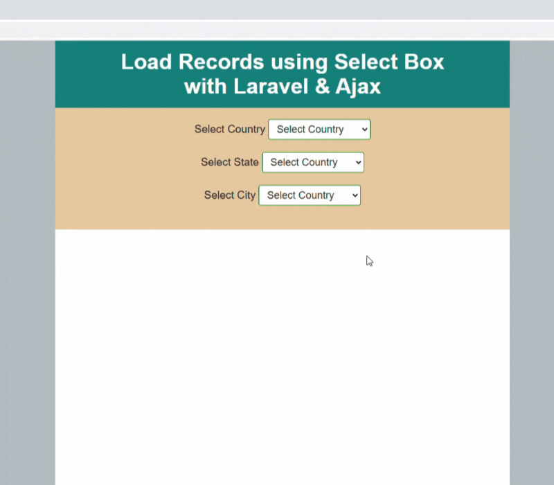

# country state city dropdown laravel
Laravel 8 dependent country state city dropdown with AJAX. you will determine how to create a dynamic dependent country state city dropdown taking jQuery AJAX’s help in the Laravel 8 application.

## How to use
Follow below given simple steps to create country state city dependent dropdown list in laravel using jQuery ajax and as well as we provide live demo:
1. git clone `git clone https://github.com/hasmukh-dharajiya/country-state-city-dropdown-laravel.git`
2. Copy `.env.example` file to `.env`
3. Create database `location`
4. Open `DB` Folder and import database `location.sql`
5. Edit database credentials in .env file `DB_DATABASE=location`
6. Run `composer install`
7. Run `php artisan key:generate`
8. Run `php artisan ser`
9. `http://127.0.0.1:8000`

You should see the list of Data, something like this:

